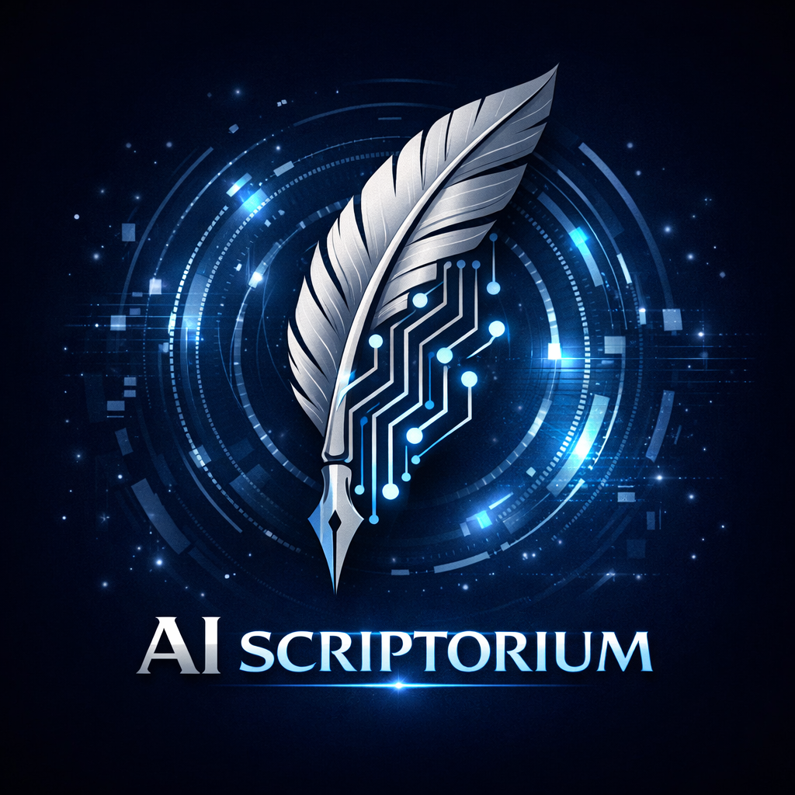

  
  &nbsp;&nbsp;&nbsp;&nbsp;
  

<h1 align="center">AI Scriptorium</h1>

  <em>An open-source initiative by <a href="https://futurefictionacademy.com/">Future Fiction Academy</a></em>

  Platforming AI authors and AI authorship tools — the latest experiments in machine-assisted storytelling, writing, and creative publishing.

  <a href="https://futurefictionacademy.com/">Website</a> · <a href="https://github.com/Future-Fiction-Academy/AI-Scriptorium">GitHub Repo</a>

---

## About

**AI Scriptorium** is Future Fiction Academy's open-source laboratory for AI-driven authorship. We build, curate, and share tools and experiments that explore how artificial intelligence can collaborate with human creativity to write, edit, and publish.

Our objective is to **platform AI authors and AI author tools**, providing the community with cutting-edge experimentation in AI-assisted storytelling and publishing workflows.

Whether you're a writer curious about AI co-creation, a developer building authorship tooling, or a creative technologist pushing the boundaries of narrative — you're in the right place.

---

## Projects

| Project | Description | Status |
|---------|-------------|--------|
| [**Vibe Code Hello World**](https://github.com/Future-Fiction-Academy/hello-world) | A minimal Python/Flask starter app for the *Vibe Coding Easy Button* series — fork it, remix it with AI, and deploy to Railway in minutes. | Active |
| [**Arcwright**](https://github.com/Future-Fiction-Academy/Arcwright) | Story-architecture and narrative tooling under development at Future Fiction Academy. | In Progress |

> More projects are on the way. Watch this repo or follow the [AI Scriptorium repo](https://github.com/Future-Fiction-Academy/AI-Scriptorium) to stay updated.

---

## Getting Started

1. **Browse the projects** above and pick one that interests you.
2. **Fork** the project repo to your own GitHub account.
3. **Open it in your favourite AI coding tool** — Claude Code, GitHub Copilot, Cursor, Codex, or anything else.
4. **Experiment, remix, and ship** your changes.

Each project README contains setup instructions specific to that tool.

---

## Contributing

We welcome contributions from writers, developers, and creative technologists alike.

- **Open an issue** with ideas, feedback, or project proposals
- **Submit a pull request** with improvements or new experiments
- **Help review and test** community projects

Open collaboration makes better creative tools for everyone.

---

## Join Future Fiction Academy

Interested in the intersection of AI and storytelling? Come build with us.

**[futurefictionacademy.com](https://futurefictionacademy.com/)**

---

## License

Individual projects carry their own licenses (see each repository). This hub repository is released under the [MIT License](LICENSE).
