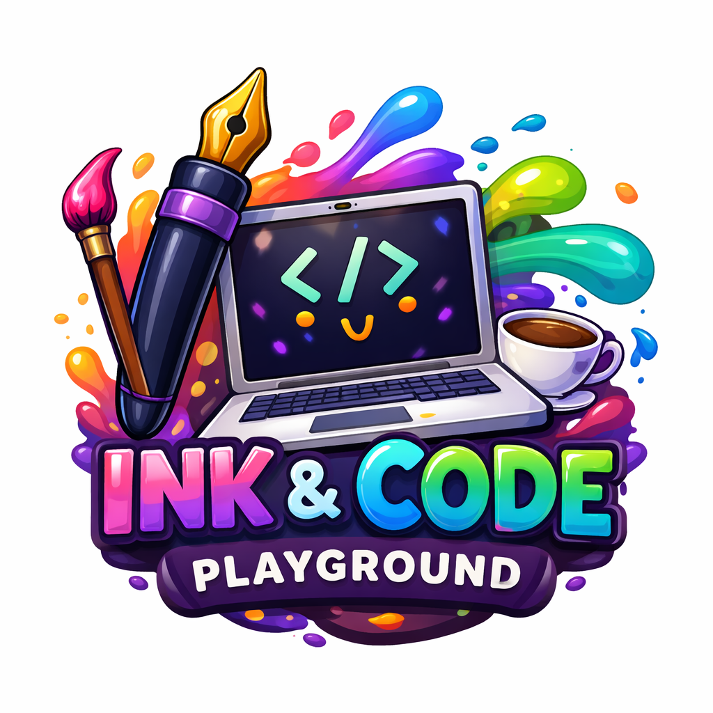

  
  &nbsp;&nbsp;&nbsp;&nbsp;
  

<h1 align="center">Ink & Code Playground</h1>

  Open tools, experiments, and community projects built by <strong>Ink & Code Playground</strong> members and friends.

---

## Welcome

This repository is the public hub for **Ink & Code Playground open-source work**.

Here, we share projects, prototypes, resources, and collaborations created by the Ink & Code Playground community. Everything published here is intended to be publicly available, shared openly, and useful to other creators.

If you're a storyteller, builder, or creative technologist, we'd love for you to join us.

---

## Projects

<table>
<tr>
<td width="50%" valign="top">

### [Arcwright](https://github.com/Future-Fiction-Academy/Arcwright)

> *Crafting worlds through code and narrative.*

Public &nbsp;|&nbsp; Updated yesterday

</td>
<td width="50%" valign="top">

### [hello-world](https://github.com/Future-Fiction-Academy/hello-world)

> *A hello world application deployment for the vibe coding easy button series.*

Public &nbsp;|&nbsp; Updated last week

</td>
</tr>
</table>

  <em>More projects on the way — stay tuned.</em>

---

## Contributing

Have an idea for an open-source project connected to Ink & Code Playground?

- Open an issue with your proposal
- Share improvements via pull request
- Help review and test community projects

We believe open collaboration creates better creative tools for everyone.

---

## License

This repository is open source. Add your preferred license file (for example, MIT) to define usage and contribution terms.
